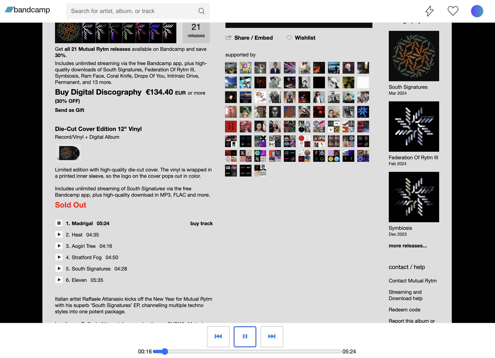

# Bandcamp Player Utility
A Bandcamp music player for music lovers

## Overview
This utility enhances the Bandcamp music listening experience by providing a user-friendly player that remains fixed at the bottom of the screen. Unlike the default Bandcamp player, which can be cumbersome to navigate, our utility offers several advantages:

## Key Features
- Continuous Playback: Easily listen to multiple songs in succession without having to scroll back to the top of the page.
- Enhanced Controls: Our player allows for seamless control over playback, including precise jumping to any point in the song with a single click (No need to drag and drop).
- Always Visible: The player remains visible at the bottom of the page, similar to popular music streaming platforms like Spotify.
- Convenient Navigation: Quickly move between songs with intuitive previous and next buttons.

## How to Use

Installation: Simply include the provided script or link in your Bandcamp page. There are two ways of using it, either as a Arc browser "Boost", or as a "Bookmarklet". Just copy and paste the code from one of those files into your favorite browser and start using it.

Enjoy: Start listening to your favorite tracks with improved control and convenience.

## Feedback and Contributions
We welcome feedback and contributions from the community to further enhance this utility. Feel free to submit issues, feature requests, or pull requests via GitHub.

## License
This project is licensed under the MIT License. Feel free to use, modify, and distribute the code according to the terms of the license.

## Acknowledgments
This player is based in every other modern player, such as Spotify's or Beatport's. All the code was written by me.
