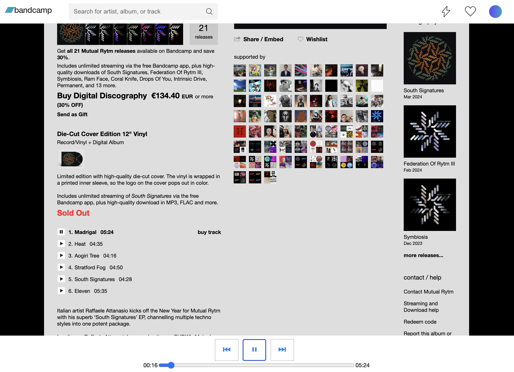

# Bandcamp Utils
Utils for Bandcamp: a better player and an experimental click-to-add-to-cart feature.

## Overview
This utility enhances the Bandcamp music listening experience by providing a user-friendly player that remains fixed at the bottom of the screen. Unlike the default Bandcamp player, which can be cumbersome to navigate, our utility offers several advantages:

## Key Features
- Continuous Playback: Easily listen to multiple songs in succession without having to scroll back to the top of the page.
- Enhanced Controls: Our player allows for seamless control over playback, including precise jumping to any point in the song with a single click (No need to drag and drop).
- Always Visible: The player remains visible at the bottom of the page, similar to popular music streaming platforms like Spotify.
- Convenient Navigation: Quickly move between songs with intuitive previous and next buttons.
- One-click Add to Cart: On album pages, "buy track" links are replaced with a price label and a 🛒 button. On track pages, the 🛒 button in the player opens the buy dialog pre-filled with the minimum price and clicks "Add to cart" for you - no page navigation required.

## How to Use

There are two ways to use this:

### Chrome Extension (recommended)

**Option A: Download from releases (no setup required):**
1. Download `bandcamp-utils.zip` from the [latest release](../../releases/latest).
2. Unzip it.
3. Open `chrome://extensions` in Chrome.
4. Enable **Developer mode** (toggle in the top-right corner).
5. Click **Load unpacked** and select the unzipped `extension/` folder.

**Option B: Clone and build:**
1. Clone this repo and run `yarn install && yarn build`.
2. Open `chrome://extensions` in Chrome.
3. Enable **Developer mode** (toggle in the top-right corner).
4. Click **Load unpacked** and select the `extension/` folder.

The extension runs automatically on every `*.bandcamp.com` page. To iterate, edit `src/content.ts`, run `yarn build`, click the reload icon on the extension, and refresh the Bandcamp tab.

### Bookmarklet
Copy the contents of `bookmarklet.js` and paste it into the URL field of a new browser bookmark. Click the bookmark on any Bandcamp page to activate it.

## Feedback and Contributions
We welcome feedback and contributions from the community to further enhance this utility. Feel free to submit issues, feature requests, or pull requests via GitHub.

## License
This project is licensed under the MIT License. Feel free to use, modify, and distribute the code according to the terms of the license.

## Acknowledgments
This player is based in every other modern player, such as Spotify's or Beatport's. All the code was written by me.
